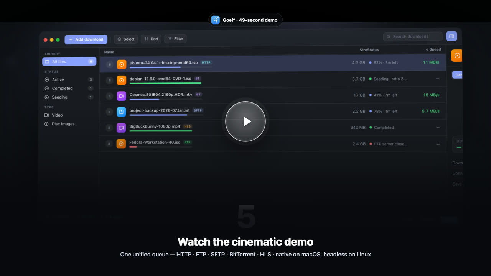
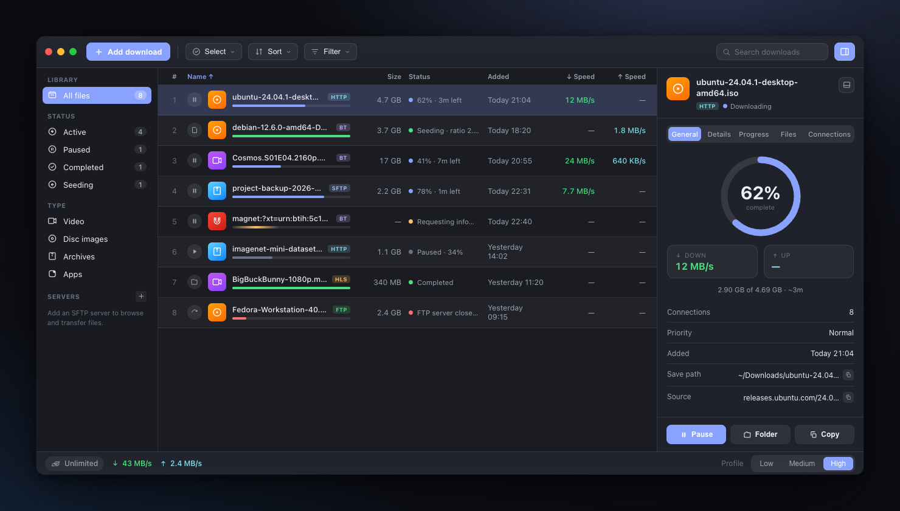
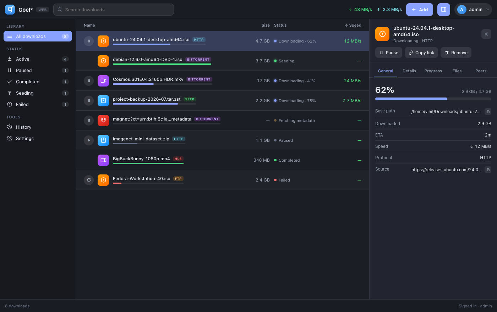
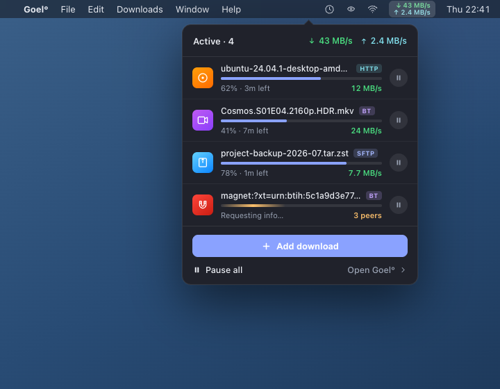

<div align="center">


# Goel°

**A fast, native macOS download manager that unifies HTTP, FTP, SFTP, BitTorrent, and HLS in one queue.**

Rebuilt from scratch in Swift, self-contained, and Homebrew-free. Native SwiftUI on macOS; a headless daemon with a web-portal UI on Linux.


<br>

<a href="Assets/videos/goel-keynote-demo.mp4"></a>

<sub><i>▶ <b><a href="Assets/videos/goel-keynote-demo.mp4">Watch the 49-second demo</a></b> 🔊 · downloads shown are illustrative mock data</i></sub>

</div>

---

## What is Goel°?

A native SwiftUI download manager for macOS. Direct downloads and torrents share **one unified queue**
and one interface — the same list, detail panel, and controls whether you're pulling a file over HTTPS
or seeding a torrent. It ships as a **single self-contained app**: every native library is bundled
inside, so there is nothing for your users to install.

On **Linux**, the same engine runs headless as **`GoelDaemon`**, driven from the built-in web portal — see [Linux (headless daemon)](#linux-headless-daemon).

---

## Licensing

**Goel° is open source code, free for personal use.** The full source is here and always
will be. Use it for your own downloads, hobby projects, study or home media at no cost,
with nothing to sign and nothing to expire.

**Commercial use requires a paid licence.** If Goel° is used in the course of a business,
by a contractor billing a client, or deployed to a company's managed fleet, you need a
commercial licence — see **[LICENSE-COMMERCIAL.md](LICENSE-COMMERCIAL.md)** for who needs one, who
does not, and how to request one.

| Your situation | What you need |
|---|---|
| Personal use, hobby, private study, home media | **Free.** Nothing to do. |
| Charity, school, university, public research, public safety/health, environmental body | **Free** — permitted by the licence itself, however you are funded. |
| Evaluating Goel° before buying | **Free.** Evaluation is welcome and is not metered. |
| Any company, sole trader, or for-profit entity | **[Commercial licence](LICENSE-COMMERCIAL.md)** |
| Contractor or consultant, in billable work | **[Commercial licence](LICENSE-COMMERCIAL.md)** |
| Managed fleet, MDM deployment, or `GoelDaemon`, **at a business** | **[Commercial licence](LICENSE-COMMERCIAL.md)** |
| The same, at a charity, school or public body | **Free** — the licence covers the institution however it deploys. |
| Bundling, reselling, or hosting Goel° for others | **[Commercial licence](LICENSE-COMMERCIAL.md)** — ask, this is quoted separately. |

Pricing, the full entitlement matrix and an enquiry form live on the
**[commercial licensing page](https://goel.vinitk.dev/commercial)**. Procurement and
security review packs — SBOM, security questionnaire, support SLA — are in
**[`docs/compliance/`](docs/compliance/)**.

**The app is identical either way.** There is no licence key, no activation, no trial
clock, no feature gating, no nag screen, and no phone-home. Every user runs the same
binary with the same capabilities, and nothing in Goel° can ever lock you out of your own
downloads. Compliance is honour-based on purpose.

<details>
<summary><b>A precise note on wording, and on the older releases</b></summary>

<br>

Goel° is licensed under **[PolyForm Noncommercial 1.0.0](LICENSE)**. That is a
**source-available** licence, not an OSI-approved open source licence — a licence with a
field-of-use restriction does not meet the Open Source Definition, and calling it "open
source" without qualification would be inaccurate. The phrasing used here is *open source
code, free for personal use*, which is exactly what it is.

The earlier git tags **`v1.0.0` and `v1.0.1` were released under the MIT License and
remain MIT-licensed forever.** An MIT grant already made cannot be retroactively revoked,
and this project will not pretend otherwise: anyone who obtained those releases keeps
their MIT rights to *those releases* in perpetuity, including for commercial use. The
PolyForm licence applies from the next release onward.

The **"Goel°" name, the g° mark and the app icon are reserved separately** from the code
licence — see **[TRADEMARK.md](TRADEMARK.md)**. Forks are welcome under PolyForm's terms,
but must pick their own name, icon and bundle identifier.

</details>

---

## Screenshots

**macOS app** — the native SwiftUI app: one unified queue, a Library/Status/Type sidebar with live counts, and a detail panel with a circular progress ring, live speeds, and per-file facts.



**Linux web portal** — the same engine, headless, driven from any browser. Token- or password-authenticated, with the same unified queue, detail panel, and four themes as the desktop app.



**macOS menu-bar extra** — glance at active downloads and pause/resume or add new ones without opening the main window.



<sub><i>All downloads shown are illustrative mock data.</i></sub>

---

## Features

- **One unified queue** — HTTP/HTTPS, FTP/FTPS, SFTP, BitTorrent, and HLS downloads share one list and one interface.
- **Segmented HTTP** — adaptive multi-connection downloads with resume, mirror/Metalink failover, and rate limiting: the traffic profile's cap holds across every HTTP download at once, not per download. FTP, SFTP and HLS are still capped per transfer, so N of those together can exceed the profile figure.
- **Full BitTorrent** — `.torrent` files and magnets via libtorrent, per-file priority, DHT/PeX/encryption toggles, and share-ratio seeding limits set per task or per traffic profile — carried across restarts by fast-resume, so ratios and upload totals survive a quit. Swarm traffic follows a **manual SOCKS5** proxy only: an HTTP proxy carries tracker announces but not peer connections, and the system proxy cannot be applied to the swarm at all. Settings states which of the three you are getting rather than implying the peers are covered.
- **SFTP browser** — browse, upload, and download on remote servers with host-key pinning.
- **HLS video** — download a finished (VOD) `.m3u8` stream to a clean `.mp4`, unencrypted or AES-128. Live streams, DRM (FairPlay/Widevine), and renditions that carry their audio as a separate track are refused with a stated reason rather than saved as a truncated or silent file.
- **Easy adding** — clipboard auto-paste, batch add, drag & drop, a floating Drop Basket, a web-page Link Grabber, and an optional bundled `yt-dlp` resolver.
- **Queue management** — sortable/filterable list, a detail panel with live speed graphs, and Low/Medium/High traffic profiles.
- **Browser integration** — a WebExtension bundled inside the app and **side-loaded**, not installed from a store. A toolbar toggle hands over every download the browser starts; right-click → **Download with Goel°** sends one link, optionally carrying your login cookies so files behind a sign-in actually download. Chromium-family browsers (Chrome, Edge, Brave, Chromium, Vivaldi, Arc) take it via Developer mode → **Load unpacked** and keep it. Firefox (128+) only accepts it as a **temporary add-on**, so it has to be re-loaded after every Firefox restart. Safari's copy ships as an app extension inside the bundle and is switched on in Safari's own settings — but Safari can do neither capture mode nor signed-in downloads, because it has no `downloads` API and its sandbox has no channel that may carry a cookie. Step-by-step per browser: **[docs/browser-extension.md](docs/browser-extension.md)**.
- **macOS native** — menu-bar extra, Dock progress, Services menu, URL scheme, AppleScript, and notifications.
- **Automation** — a watched folder for `.torrent` files, scheduled download windows, power/network awareness (pause below a battery percentage; pause on an expensive or constrained network), and post-download actions (extract, script, antivirus scan).
- **Remote control** — an optional token-authenticated local HTTP server to manage downloads from another device.
- **Checksums & history** — MD5/SHA verification plus searchable, re-downloadable history with CSV export.
- **Self-contained** — every native library is bundled; no Homebrew or dependencies for end users.
- **Runs headless on Linux** — the same engine runs as a daemon (`GoelDaemon`) with the web portal as its UI.

---

## Installation (macOS)

> **Requires a Mac on macOS 14 (Sonoma) or later** — Apple Silicon **or** Intel.

1. Download the latest `.dmg` for your Mac from
   [Releases](https://github.com/vinitkumargoel/goel/releases):
   **`Goel-Downloader-<version>-macos-arm64.dmg`** (Apple Silicon) or
   **`…-macos-x86_64.dmg`** (Intel).
2. Open the `.dmg` and drag **Goel°** to **Applications**.
3. Launch it.

Everything the app needs is bundled — **no Homebrew or libraries required.**

**Known issue with the `1.0.0` and `1.0.1` downloads:** those two archives were built before
`Scripts/check_min_os.sh` existed, and the OpenSSL and libtorrent dylibs vendored into them declare a
minimum of **macOS 26.0** (libssh2 declares 15.0) even though the app advertises 14.0. dyld refuses an
over-targeted library before `main()`, so on a Mac between Sonoma and macOS 26 those builds quit on
launch. Check a copy you already hold with `Scripts/check_min_os.sh "/Applications/Goel°.app"`. The gate
runs in both `Scripts/build_app.sh` and `Scripts/make_dmg.sh` from `1.0.3` onward, so no later archive can
be produced with the mismatch.

**First-launch note (Gatekeeper):** a notarized release just opens. For an un-notarized build (e.g. a
beta), right-click the app → **Open** → **Open**, or run once:
```bash
xattr -dr com.apple.quarantine "/Applications/Goel°.app"
```

**Video-site downloads (yt-dlp):** the “Resolve Media with yt-dlp” button turns a video-site page into
a direct download. Official releases bundle `yt-dlp`; otherwise install it yourself (`brew install yt-dlp`).

---

## Linux (headless daemon)

On Linux, Goel° runs as a headless service — **`GoelDaemon`** — with the built-in **web portal as its UI**.
The same engine (HTTP, FTP, SFTP, BitTorrent, HLS, scheduler, persistence) runs behind a token- or
password-authenticated web server that you drive from any browser.

### Install

```bash
curl -fsSL https://goel.vinitk.dev/install.sh | sudo sh
```

That installs the daemon as a systemd service, creates an unprivileged `goel` user, generates a
portal password and prints it once, and puts the **`goel`** command on your PATH:

```bash
sudo goel status          # is it running, and where
sudo goel add <url>       # queue a download
sudo goel config set port 9090
sudo goel doctor          # check the whole install
sudo goel help            # everything else
```

Prebuilt for **x86_64** and **aarch64**; needs systemd and glibc. The Swift runtime, libtorrent
and Boost travel inside the tarball, so one build works across Ubuntu releases. Re-running the
installer upgrades in place and keeps your config, queue and downloads.

**[docs/linux.md](docs/linux.md) is the full guide** — installer options, every configuration key,
writable-path handling under `ProtectSystem=strict`, upgrading, uninstalling, running without
systemd, non-Debian distributions, and building from source.

---

## Building the macOS app from source

> **Just want to run it?** Download the `.dmg` from
> [Releases](https://github.com/vinitkumargoel/goel/releases) — this section is only for
> building the app yourself.

You need Homebrew **only to build** — the resulting `.app` is self-contained.

```bash
# 1. Native libraries the engines link against
brew install libtorrent-rasterbar openssl@3 libssh2 boost

# 2. Debug build / run
swift build
swift run GoelDownloader

# 3. Assemble a self-contained .app (vendors dylibs, strips, signs)
Scripts/build_app.sh          # → dist/Goel°.app  (local build — no release archive)

# 4. Wrap it in a drag-to-Applications disk image
GOEL_LOCAL_DEV=1 Scripts/make_dmg.sh   # unsigned image, written outside dist/
```

**Signing & notarization** (for public distribution) — provide Apple Developer credentials:
```bash
GOEL_RELEASE=1 \
CODESIGN_IDENTITY="Developer ID Application: Your Name (TEAMID)" \
NOTARY_PROFILE="your-notarytool-keychain-profile" \
Scripts/build_app.sh
```
This signs with hardened runtime + the entitlements in `Scripts/Goel.entitlements`, submits to Apple's
notary service, and staples the ticket — which is what lets a downloaded app open without warnings.
`GOEL_RELEASE=1` is what makes a release a release: without it the script produces a local build and
emits **no** distributable archive, because an Apple Development signature is valid for signing and
rejected by Gatekeeper everywhere else. With it, the archive is written only after `spctl` reports
`source=Notarized Developer ID` and the ticket validates.

**Bundling toggle:** `BUNDLE_YTDLP=0 Scripts/build_app.sh` builds without the ~35 MB yt-dlp binary.

**If the build stops on deployment targets:** the vendored Homebrew dylibs are built for the OS of
the machine that poured them, and dyld refuses one that needs a newer macOS than the app advertises —
`Scripts/check_min_os.sh` catches that before it ships. Build on a macOS 14 machine or runner (as CI
does), rebuild the dependencies with `MACOSX_DEPLOYMENT_TARGET=14.0`, or set `GOEL_LOCAL_DEV=1` for a
throwaway build that warns instead (and produces nothing distributable).

**Cutting a release:** follow **[RELEASE.md](RELEASE.md)** step by step — CI covers build, tests and
the packaging gates; RELEASE.md covers signing, notarisation, the DMG, Sparkle appcast signing, and
rollback.

---

## Updating

**Goel° does not check for updates unless you switch it on.** Both routes below start inert, so a fresh
install makes no update request at all.

- **Sparkle** — the framework is bundled, but it stays **dormant unless the build stamps an appcast URL
  and its EdDSA public key into `Info.plist`** (`SPARKLE_FEED_URL` + `SPARKLE_ED_KEY` — see
  [RELEASE.md](RELEASE.md)). No published release has carried a feed yet, so in the builds on the
  Releases page today Sparkle does nothing; the updater refuses to start rather than half-run.
- **Built-in checker** — a lightweight GitHub-Releases feed check, and the one that actually runs.
  Automatic checking is **off** by default and the feed URL starts empty; set both in
  **Settings → Advanced**, then **Check Now**. With no feed URL configured the button says so instead of
  reporting "up to date".

Third-party libraries are frozen at build time and travel inside each release; there is no separate
library updater by design.

---

## Documentation

- **[docs/getting-started.md](docs/getting-started.md)** — install, first download, the basics.
- **[docs/browser-extension.md](docs/browser-extension.md)** — installing Goel° Capture in Chrome, Edge, Brave, Firefox and Safari.
- **[docs/faq.md](docs/faq.md)** — the questions that actually get asked.
- **[docs/troubleshooting.md](docs/troubleshooting.md)** — when something goes wrong.
- **[docs/remote-api.md](docs/remote-api.md)** — the JSON routes the remote/web UI speaks.
- **[docs/compliance/](docs/compliance/)** — SBOM, security questionnaire, support SLA.

---

## Contributing

Bug reports, fixes and ideas are welcome. Read **[CONTRIBUTING.md](CONTRIBUTING.md)**
first — every commit needs a DCO `Signed-off-by:` trailer (`git commit -s`), and that
file explains why in plain terms. Security issues go to **[SECURITY.md](SECURITY.md)**,
not to a public issue.

---

## License

Goel° is released under the **[PolyForm Noncommercial License 1.0.0](LICENSE)** —
© 2026 Vinit Kumar Goel. Free for personal use; **commercial use requires a paid
licence**, see **[LICENSE-COMMERCIAL.md](LICENSE-COMMERCIAL.md)** and the
[Licensing](#licensing) section above.

The `v1.0.0` and `v1.0.1` tags remain MIT-licensed forever and that grant is irrevocable;
PolyForm applies from the next release onward.

The Goel° name and the g° mark are reserved — see **[TRADEMARK.md](TRADEMARK.md)**.
Bundled third-party components and their licences are listed in
**[THIRD-PARTY-NOTICES.md](THIRD-PARTY-NOTICES.md)**.
Release history is in **[CHANGELOG.md](CHANGELOG.md)**.
